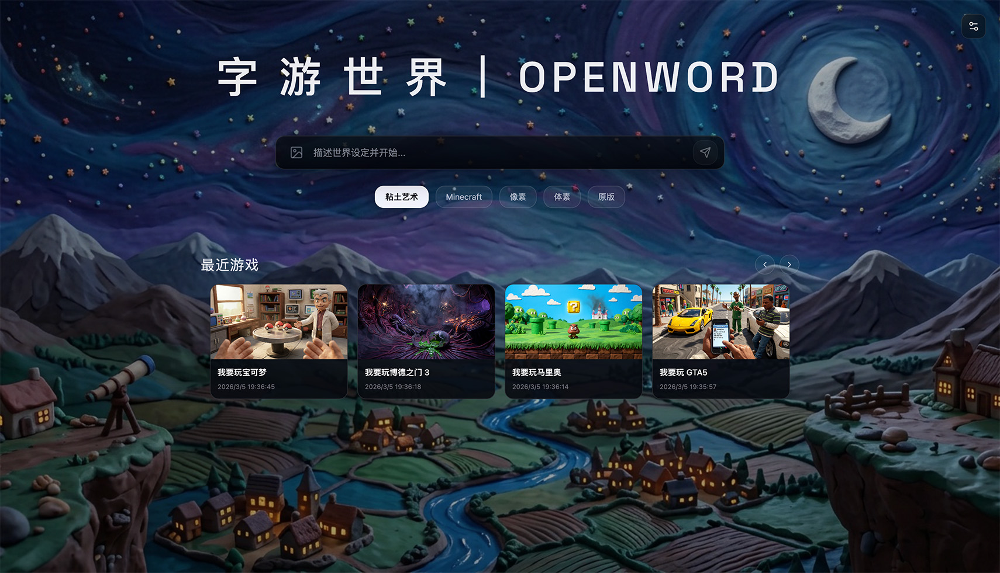
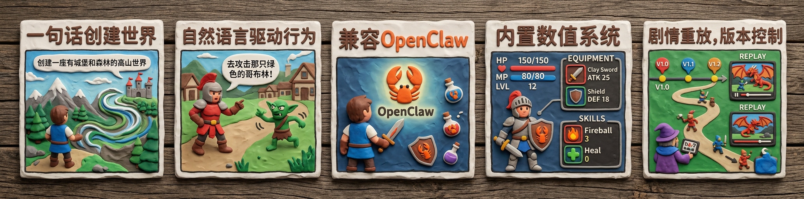

🌐 语言：[中文](../README.md) | English



Generate a game world from one sentence, then continue an endless adventure through ongoing dialogue.

[How to Use](#how-to-use) · [How to Play](#how-to-play) · [API DOC](#rest-api) · [Notes](#notes)

## Key features

- Multi-agents support story narration, scene rendering, stat systems (equipment, skills, percentage-based values), and AutoPlay.
- Local agents such as OpenClaw and Cursor can connect to the game via API.
- Supports story replay, checkpoints, and multilingual content.

## How to Use

### Method 1: Agent install

```bash
# Install the OpenWord skill
npx skills add https://github.com/dinghuanghao/openword

# Then let your agent complete installation based on the skill
```

### Method 2: Manual install

```bash
# Prerequisites: Node.js, npm
git clone https://github.com/dinghuanghao/openword.git
cd openword
npm install

# Configure GEMINI_API_KEY before startup (env var or .env)
# Example: put GEMINI_API_KEY=your_key in .env

npm run dev
```

### Method 3: Online Demo

Visit [https://agentlive.ai/demos/openword/](https://agentlive.ai/demos/openword/).

Note: you need to enter your own API-KEY.

### First-time setup

1. Open `http://127.0.0.1:30000`.
2. If `GEMINI_API_KEY` is not fully configured during the automatic/manual process, finish it in the first-launch popup or settings page after opening the site.

## How to Play

OpenWord supports three role types that can switch and collaborate in the same run:
- **Human player**: Type actions in the browser to push the story forward.
- **Built-in AI (Auto Player)**: Click the robot icon in the top-right corner. After enabling it, AI can take over and decide the next action automatically. Press `ESC` to exit bot mode.
- **External Agents (OpenClaw, Cursor, etc.)**: Read game state and execute actions via REST API, sharing the same runtime with human players.

## REST API

### Overview

Minimum requirements for external agent integration:

- Keep the frontend page online: the frontend is the game runtime; the API forwards requests to the frontend page.
- Toggle the BFF WebSocket bridge:
  - REST API currently reaches BFF first, then forwards to frontend via WebSocket. BFF can only bind to the first browser tab (otherwise it cannot determine the forwarding target).
  - Click `Connect API Bridge` in settings to toggle the WebSocket connection (to connect another tab, first disconnect the existing one, or simply close that page).
- Default API endpoint: `http://127.0.0.1:30000`

Recommended workflow:

1. `create_game` to start a new game
2. `load_game` (optional) to load an existing save
3. `do_action` to advance turns
4. `get_current_game_state` to fetch latest `world_view` / `narrative` / `player_profile` / `last_scene_image_path`
5. `show_history_games` to list game history

### Schema

| Method | Path | Body | Core return fields |
| --- | --- | --- | --- |
| `POST` | `/api/create_game` | `{ "description": string, "style": string, "image_path"?: string }` | `status`, `game_id` |
| `GET` | `/api/show_history_games` | - | `status`, `games` |
| `POST` | `/api/load_game` | `{ "game_id": string }` | `status` |
| `GET` | `/api/get_current_game_state` | - | `status`, `game_id`, `world_view`, `narrative`, `player_profile`, `last_scene_image_path` |
| `POST` | `/api/do_action` | `{ "description": string }` | `status`, `game_id`, `world_view`, `narrative`, `player_profile`, `last_scene_image_path` |

`create_game.image_path` accepts absolute paths. If a relative path is provided, it will be resolved from the repository root.

`GET /api/get_current_game_state` writes the latest scene image to:

`<repoRoot>/.openword/<game_id>/latest_game_scene.<ext>`

When the bridge is not connected, the API returns `NO_BRIDGE`.

### Example

Some API calls may take around 10+ seconds, depending on network speed and world complexity.

```bash
# 1) Create a game
curl -X POST http://127.0.0.1:30000/api/create_game \
  -H "Content-Type: application/json" \
  -d '{"description":"I want to play The Elder Scrolls V","style":"Minecraft"}'

# 1.1) Create a game (optional: specify local reference image path)
curl -X POST http://127.0.0.1:30000/api/create_game \
  -H "Content-Type: application/json" \
  -d '{"description":"I want to play Baldur's Gate 3","style":"Minecraft","image_path":"./images/init.png"}'

# 2) Advance one turn
curl -X POST http://127.0.0.1:30000/api/do_action \
  -H "Content-Type: application/json" \
  -d '{"description":"While the guards are distracted, set the wagon on fire"}'

# 3) Get current state
curl http://127.0.0.1:30000/api/get_current_game_state
```

## Notes

- The app tries to auto-connect Bridge by default; only one tab can hold the connection at a time. Usually, the first tab that connects successfully is usable.
- Supports language switching: `zh-CN` / `en-US`.
- Data is stored in browser storage by default (IndexedDB first, falls back to localStorage).
- Supports single-save `import` / `export` (JSON).
- Supports batch save package `import` / `export` (JSON, overwrite by `game_id`).
- Port details: unified access endpoint is `http://127.0.0.1:30000` (same in development mode; Vite proxies `/api`, `/health`, `/ws` to internal BFF); internal BFF default port is `31000`.
